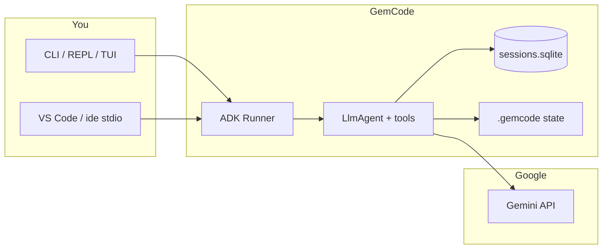

# GemCode

**GemCode** is a **local-first coding agent** that runs on your machine against **your repositories**. It uses **Google Gemini** and Google’s **[Agent Development Kit (ADK)](https://google.github.io/adk-docs/)** to read and edit files, run allowlisted shell commands, search code and (optionally) the web, and coordinate multi-step work—with **explicit permissions**, **session persistence**, **checkpoints**, **audit logs**, and optional modalities such as **deep research**, **embeddings**, **browser automation**, and **live audio**.

GemCode is an independent **clean-room** design on Gemini + ADK, not a thin wrapper around a hosted IDE agent.

---

## What GemCode is (whole picture)

### Problem it solves

You want an agent that:

- Works **in the repo** (not only in a chat box with pasted snippets).
- Respects **your** rules: which folders, which commands, when to ask before writing.
- Leaves a **trail** you can inspect (audit log, diffs, checkpoints).
- Can be extended with **project-local** instructions (`GEMINI.md`), **skills** (markdown playbooks), **output styles**, and **rules**.

### How it works (high level)



1. You pick a **project root** (`gemcode -C /path/to/repo`).
2. GemCode builds an ADK **Runner** with an **LlmAgent** and a **tool set** driven by flags and environment (filesystem, edit, shell, search, optional web/MCP/computer-use, etc.).
3. Each **turn**: the model may call tools; results return until the turn finishes or **limits** (e.g. `max_llm_calls`, token budgets) apply.
4. **History** is stored in **SQLite** under `.gemcode/` (keyed by session id). **Policy**, **tool-result offload**, **notes**, **evals**, **skills**, and more live beside it.

### What GemCode is not

- **Not** a hosted SaaS that owns your code path—you run the process locally.
- **Not** tied to a single editor—CLI-first, plus optional **VS Code** and **web** integrations.
- **Not** a guarantee of “safe” arbitrary shell: execution is **allowlisted** and **permission-gated** by design.

---

## Layers (reference)

| Layer | Role |
|--------|------|
| **Model** | Gemini (configurable ids, **model mode** `fast`/`balanced`/`quality`/`auto`, optional **family** routing, per-capability models). |
| **Orchestration** | ADK `Runner` / `LlmAgent`: model ↔ tools until the turn completes or limits hit. |
| **Tools** | Function tools: filesystem, grep, repo map, edit, shell (`bash` / `run_command`), notebooks, web helpers, **skills**, **memory**, **checkpoints**, **subtasks**, optional **MCP**, **computer use**, **deep research** built-ins, etc. |
| **Session** | SQLite-backed history under `.gemcode/sessions.sqlite`; reuse with `--session`. |
| **Safety** | Workspace **trust**, permission modes, optional **HITL** approval per sensitive tool, command allowlists, circuit breaker, recovery. |
| **UX** | One-shot CLI prompts, interactive **REPL**, optional **scrollback TUI** (`GEMCODE_TUI`), **slash commands** + **readline Tab completion**, VS Code extension, **`gemcode ide --stdio`**, example web API. |

---

## Documentation map

| Document | Contents |
|----------|----------|
| **[`gemcode/README.md`](gemcode/README.md)** | **Primary manual**: install, CLI, flags, `.gemcode/` layout, tools catalog, slash commands, GemSkills (create / load / append), curated memory, styles, rules, checkpoints, evals, hooks, IDE, Kaira, live audio, env vars, release. |
| **[`docs/README.md`](docs/README.md)** | Index of repo docs. |
| **[`docs/web-ui-contract.md`](docs/web-ui-contract.md)** | HTTP/SSE shapes for compatible web frontends. |
| **[`gemcode-vscode/README.md`](gemcode-vscode/README.md)** | VS Code extension: commands, settings, Chat, diff apply, stdio bridge. |

---

## Quickstart

**Requirements:** Python 3.11+, `GOOGLE_API_KEY` ([Google AI Studio](https://aistudio.google.com/app/apikey)).

```bash
cd gemcode
python3 -m venv .venv
source .venv/bin/activate   # Windows: .venv\Scripts\activate
pip install -e .
```

Copy `gemcode/.env.example` to `.env` and set `GOOGLE_API_KEY`, or run:

```bash
gemcode login
```

**One-shot from a project root:**

```bash
gemcode -C /path/to/repo "Explain how authentication works"
gemcode -C /path/to/repo --yes "Fix the failing test in tests/test_foo.py"
```

**Interactive REPL** (no prompt argument):

```bash
gemcode -C /path/to/repo
```

Use natural language, or **slash commands** (`/help`, `/status`, `/gemskill`, …). Exit with `/exit` or Ctrl+D.

---

## Feature highlights

- **Dynamic token policy** — Tool output caps and risk-aware budgets; optional self-tuning `.gemcode/policy.json`.
- **Tool output offloading** — Large outputs under `.gemcode/tool-results/` as stable `tool_result:<sha>` references.
- **Repo map** — Compact symbol-oriented overview; read full files on demand.
- **GemSkills** — Markdown playbooks in `.gemcode/skills/` (and `~/.gemcode/skills/`): **`/create gemskill`**, **`/gemskill`** (session load), **`/append gemskill`** (iterate file), **`/skill`**, **`/<skill-name>`**, tools `list_skills` / `load_skill`; built-in **`/batch`** orchestrator.
- **Curated memory** — Human/agent curated facts (`GEMCODE_MEMORY.md`, `GEMCODE_USER.md`); tools + **`/curated`**.
- **Output styles & rules** — `.gemcode/output-styles/*.md`, `.gemcode/rules/*.md` (optional path gating); **`/style`**, **`/rules`**.
- **Checkpoints** — **`/diff`**, **`/rewind`** (alias **`/checkpoint`**).
- **Multi-root** — **`/add-dir`** for extra read/search roots.
- **Eval & autotune** — `gemcode eval`, `gemcode autotune`, REPL **`/eval`**, **`/autotune`**; artifacts under `.gemcode/evals/`.
- **Optional powers** — Deep research, embeddings + memory, Playwright computer use, MCP (`.gemcode/mcp.json`), **Kaira** job daemon, **`gemcode live-audio`**.

---

## Repository layout

| Path | Purpose |
|------|---------|
| `gemcode/` | Python package (`pip install -e .`), CLI entry **`gemcode`**. |
| `gemcode-vscode/` | VS Code extension. |
| `gemcode-web-api/` | Example Node server (terminals, chat wiring). |
| `docs/` | Contracts and doc indexes. |

---

## PyPI releases

Tags matching **`v*`** can drive publishing (see `.github/workflows/` and **`gemcode/README.md` → Development and release**).

---

## License

See the `LICENSE` file in this repository (and `gemcode/LICENSE` if present).
