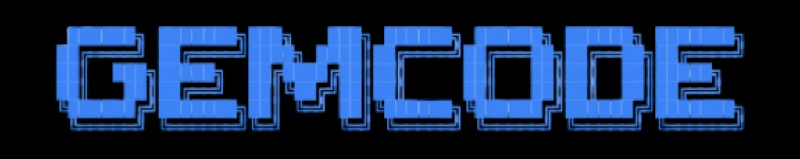

<p align="center">
  
</p>

<p align="center">
  <a href="https://pypi.org/project/gemcode/"></a>
  <a href="https://github.com/Veoksha/GemCode/releases"></a>
  <a href="https://github.com/Veoksha/GemCode/blob/main/gemcode/LICENSE"></a>
  
  
  
  <a href="https://gemcode.veoksha.com"></a>
</p>

<h3 align="center">The coding agent that learns your codebase and gets smarter every session.</h3>

<p align="center">
  Built on Google Gemini + ADK. Self-healing. Self-evolving. Multi-agent. Local-first.
</p>

---

## What makes GemCode different

Most coding agents treat every turn as isolated — read files, make changes, forget everything. GemCode builds a **persistent understanding** of your codebase that compounds over time.

| What it does | How |
|---|---|
| **Remembers your project** | Structure graph tracks files, imports, exports. Change journal logs what changed and why. Insight cache learns facts like "changing config.py breaks test_config.py." |
| **Heals its own mistakes** | After every change, auto-runs tests. If they fail, auto-fixes. Closed loop: change → verify → fix → verify → done. |
| **Creates its own tools** | When it repeats the same multi-step operation, it synthesizes a reusable script. Future invocations use the tool instead of repeating steps. |
| **Runs a team of agents** | Org members are real ADK sub-agents with their own workspace, memory, and persistent history. They delegate, verify, and fix each other's work. |
| **Wakes up on schedule** | **Habits** and **triggers** run in-process (no extra terminal). **File automations** under `.gemcode/automations/` need a running **`gemcode runtime`** (optionally `--automations`). |
| **Gets smarter every session** | Skills self-improve from successes. Delegation learning remembers which agent handles what best. Capabilities auto-enable based on project patterns. |

---

## Quick Start

```bash
pip install gemcode
export GOOGLE_API_KEY="your-key"
gemcode -C /path/to/project
```

That's it. On first run, GemCode asks: **"Enable autonomous mode? [Y/n]"** — say yes and everything activates.

### Super mode (zero friction)

```bash
gemcode -C . --super "Fix all failing tests and verify"
```

All powers unlocked. No confirmation prompts. Memory, agents, habits, triggers, self-healing — everything on.

### One-shot

```bash
gemcode -C . --yes "Add pagination to the /users API endpoint"
```

### Background agents

```text
> Analyze the auth module. Delegate security review to the verifier.
```

The LLM calls `transfer_to_agent(agent_name='verifier')` → ADK routes natively → verifier runs with its own tools → result saved to session state.

---

## The Intelligence Stack

GemCode isn't just tools — it's a learning system where every feature feeds the next.

```
┌─────────────────────────────────────────────────────────────────┐
│                        Every Turn                                │
│                                                                 │
│  Codebase Awareness ──→ knows files, imports, recent changes    │
│  Intelligence Layer ──→ picks model, enables capabilities       │
│  Agent Mesh ──────────→ delegates to sub-agents if needed       │
│  [Model ↔ Tools loop]                                           │
│  Self-Healing ────────→ auto-verifies, auto-fixes failures      │
│  Learning ────────────→ records outcomes, improves skills        │
│  Awareness Update ────→ structure graph, journal, insights       │
│                                                                 │
│  Next turn starts smarter than the last.                        │
└─────────────────────────────────────────────────────────────────┘
```

### Codebase Awareness

Every `read_file`, `grep`, `write_file`, and `bash` call silently builds three layers:

- **Structure Graph** — files, imports, exports, symbol counts
- **Change Journal** — what changed, when, what the outcome was
- **Insight Cache** — "tests take 12s", "auth imports from 3 modules", "changing X breaks Y"

The agent starts each turn knowing the project. No re-exploration needed.

### Self-Healing Loop

```
change files → auto-detect verification command (pytest/npm test/cargo check)
            → run only affected tests (via import tracking)
            → if fail → auto-fix → re-verify
            → if fail again → report with diagnosis
            → record correlation: "changing A broke test B"
            → next time A changes → test B runs immediately
```

### Tool Synthesis

```python
# Agent detects it's running the same 3 commands repeatedly
# It creates a reusable tool:
synthesize_tool("deploy", "Deploy to staging", "git push && ssh staging 'cd app && git pull'")

# Future invocations:
run_synthesized_tool("deploy")  # one call instead of three
```

### Agent Habits

```python
habits_add("test-watch", "kaira", "Run pytest -q and report", every_minutes=30)
habits_add("nightly-audit", "verifier", "Full security review", daily_at="02:00")
```

Agents wake up on schedule, do their work, report back. Habits execute via the in-process scheduler (no separate `gemcode runtime` required for basic recurring prompts).

---

## Multi-Agent Orchestration

Each org member is a **full GemCode session** — own workspace, own memory, own persistent history.

### Two delegation paths

| Path | When to use | How it works |
|------|-------------|--------------|
| **Synchronous** (ADK native) | Quick reviews, exploration | LLM calls `transfer_to_agent` → ADK routes → result in session state |
| **Asynchronous** (mesh) | Long tasks, tests, builds | `org_delegate("<member>", "run tests")` → background job → result via fleet reports (often a `kaira_worker` org member) |

### Self-triggering agents

Agents auto-activate on events:
- Job finishes → verifier reviews the output
- Job fails → kaira diagnoses and attempts fix
- Files change → verification triggers (opt-in)

### Cross-machine agents (A2A)

```python
a2a_expose("verifier", port=8001)  # expose as network service
a2a_connect("remote-reviewer", "http://other-machine:8001/.well-known/agent-card.json")
```

Any A2A-compatible agent (GemCode, LangGraph, CrewAI) can connect.

---

## 58 Built-in Tools

| Category | Tools |
|----------|-------|
| **Planning** | `todo_write`, `todo_read`, `think` |
| **Filesystem** | `read_file`, `list_directory`, `glob_files`, `write_file`, `search_replace`, `move_file`, `delete_file` |
| **Search** | `grep_content`, `repo_map` |
| **Shell** | `bash`, `run_command`, `list_tasks`, `kill_task`, `task_output` |
| **Web** | `web_search`, `web_fetch` |
| **Notebooks** | `notebook_read`, `notebook_edit` |
| **Memory** | `remember_fact`, `read_curated_memory`, `compress_memory_file`, `summarise_session` |
| **Skills** | `list_skills`, `load_skill`, `skills_manifest` |
| **Checkpoints** | `checkpoints_list`, `checkpoint_undo` |
| **Orchestration** | `org_list`, `org_hire`, `org_tree`, `org_delegate`, `org_spawn`, `org_improve` |
| **Mesh** | `mesh_status`, `mesh_delegate`, `mesh_report`, `mesh_enqueue`, `agent_dm`, `agent_broadcast` |
| **A2A** | `a2a_expose`, `a2a_connect`, `a2a_list` |
| **Triggers** | `triggers_list`, `triggers_add`, `triggers_remove` |
| **Habits** | `habits_add`, `habits_list`, `habits_remove`, `habits_pause`, `habits_resume` |
| **Synthesis** | `synthesize_tool`, `run_synthesized_tool`, `list_synthesized_tools` |
| **Delegation** | `suggest_delegate` |

Plus: `load_tool_result`, `load_artifacts`, `get_user_choice`, `exit_loop`, and modality tools (deep research, embeddings, computer use).

---

## Full ADK Integration

GemCode uses every major ADK primitive:

| ADK Feature | How GemCode uses it |
|---|---|
| `LlmAgent` with `sub_agents` | Org members are native sub-agents with `transfer_to_agent` |
| `output_key` | Agent outputs auto-saved to session state |
| `SequentialAgent` | Used in the parallel review pipeline |
| `ParallelAgent` | Available for concurrent workflows |
| `LoopAgent` | Available for iterative refinement |
| `AgentTool` | Available for explicit agent-as-tool invocation |
| `RemoteA2aAgent` / `to_a2a()` | Cross-machine agent communication |
| `SqliteSessionService` | Persistent sessions across restarts |
| `EmbeddingFileMemoryService` | Semantic memory with embeddings |
| `FileArtifactService` | Binary artifact storage |
| `ContextCacheConfig` | Gemini context caching (saves ~75% input tokens) |
| `EventsCompactionConfig` | Sliding-window session summarization |
| `LongRunningFunctionTool` | Bash/shell tools with streaming timeout handling |
| `GlobalInstructionPlugin` | System instruction injection |
| `ReflectAndRetryToolPlugin` | Automatic tool error recovery |

---

## Capabilities

| Capability | Toggle | What it adds |
|---|---|---|
| **Codebase Awareness** | `GEMCODE_CODEBASE_AWARENESS=1` | Persistent project understanding (structure, changes, insights) |
| **Self-Healing** | `GEMCODE_SELF_HEALING=1` | Auto-verify + auto-fix after changes |
| **Tool Synthesis** | `GEMCODE_TOOL_SYNTHESIS=1` | Agent creates reusable tools from patterns |
| **Agent Habits** | `GEMCODE_AGENT_HABITS=1` | Scheduled recurring tasks |
| **Self-Triggers** | `GEMCODE_AGENT_TRIGGERS=1` | Event-driven agent activation |
| **Delegation Learning** | `GEMCODE_DELEGATION_LEARNING=1` | Remembers successful delegation patterns |
| **Intelligence Layer** | `GEMCODE_AGENT_INTELLIGENCE=1` | Structural decisions + auto-enable capabilities |
| **Deep Research** | `/research on` | Web search + URL context + grounding |
| **Embeddings** | `/embeddings on` | Semantic search + embedding-backed memory |
| **Memory** | `/memory on` | Persistent memory across sessions |
| **Computer Use** | `/computer on` | Playwright-backed browser automation |
| **Code Executor** | `/code on` | Sandboxed Python execution via Gemini |
| **Plan Mode** | `/plan on` | Explicit numbered plan before execution |

All default to ON in super mode.

---

## Project State (`.gemcode/`)

```
.gemcode/
├── sessions.sqlite          # Persistent session history
├── memories.jsonl           # Embedding-backed memory
├── GEMCODE_MEMORY.md        # Curated project facts
├── GEMCODE_USER.md          # User preferences
├── org.json                 # Agent fleet registry
├── fleet_reports.jsonl      # Background agent results
├── delegation_memory.jsonl  # Delegation learning history
├── triggers.json            # Self-trigger rules
├── habits.json              # Scheduled recurring tasks
├── project_profile.json     # Project capability profile
├── awareness/
│   ├── structure.json       # File relationships, imports, exports
│   ├── journal.jsonl        # Change log
│   └── insights.json        # Learned facts and correlations
├── synthesized_tools/       # Agent-created reusable scripts
├── agents/                  # Per-agent workspaces
├── skills/                  # GemSkills (reusable playbooks)
├── checkpoints/             # File snapshots for undo
├── automations/             # Scheduled job configs
├── artifacts/               # Binary outputs
├── hooks/                   # Shell lifecycle hooks
├── mcp.json                 # MCP server config
├── openapi/                 # OpenAPI tool specs
└── audit.log                # Full audit trail
```

---

## REPL Commands

| Command | Purpose |
|---|---|
| `/help` | Command summary |
| `/status` | Model, capabilities, context telemetry |
| `/super` | Unlock all powers / `/super off` |
| `/agent list` | Show org members |
| `/agent create` | Create a new agent |
| `/agent assign <member> <task>` | Delegate work |
| `/review` | Parallel code review (security + style + correctness) |
| `/diff` | Show current diff / checkpoint diff |
| `/rewind` | Restore checkpoints |
| `/compact` | Compress context |
| `/skills` | List available skills |
| `/model use <id>` | Switch model mid-session |

---

## Install

```bash
# From PyPI
pip install gemcode

# From source
cd gemcode
python3 -m venv .venv && source .venv/bin/activate
pip install -e ".[dev]"

# Set your API key
export GOOGLE_API_KEY="your-key"

# Run
gemcode -C /path/to/project
```

---

## Documentation

| Doc | What it covers |
|---|---|
| [Orchestration](docs/orchestration.md) | Agent mesh, triggers, habits, self-healing, awareness, A2A |
| [Architecture](docs/architecture.md) | System design, subsystems, data flow |
| [CLI & REPL](docs/cli-and-repl.md) | Commands, keybindings, sessions |
| [Configuration](docs/configuration.md) | Environment variables, config files |
| [Tools & Permissions](docs/tools-and-permissions.md) | Tool categories, permission model, super mode |
| [Capabilities](docs/capabilities.md) | Research, embeddings, memory, computer use |
| [Integrations](docs/integrations.md) | IDE bridge, MCP, OpenAPI, web UI |
| [Operations](docs/operations.md) | Deployment, troubleshooting, PyPI |

---

## Website

[gemcode.veoksha.com](https://gemcode.veoksha.com)

---

## License

Apache 2.0
